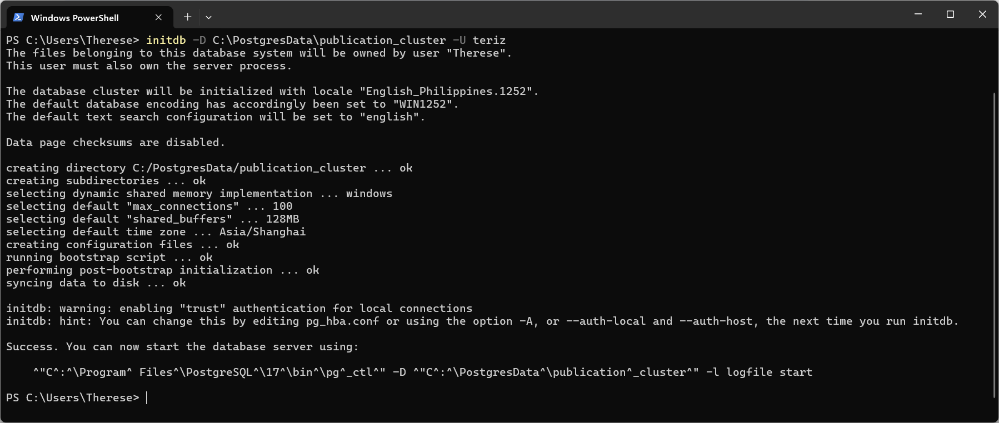
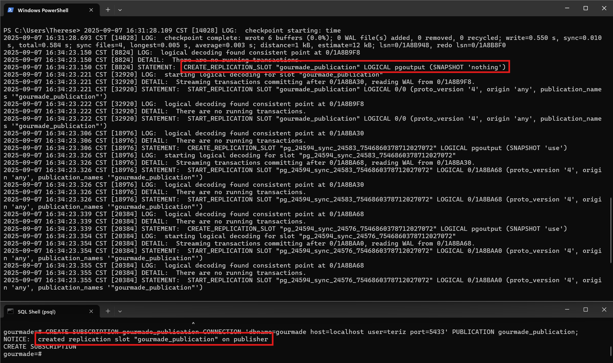
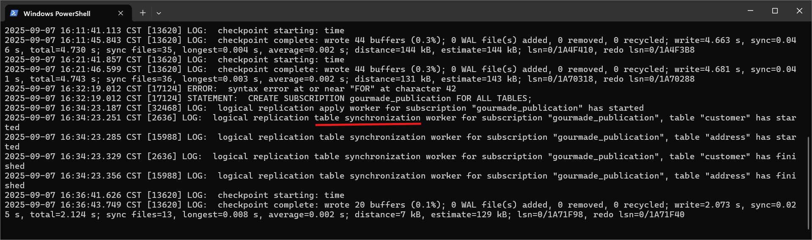

# [Write-Ahead Logging (WAL)](https://stormatics.tech/blogs/beginners-guide-wal-in-postgresql)

WAL is a critical feature in Postgres that ensures data integrity and durability. It records changes to the database before they are applied, allowing Postgres to recover data and restore the database to its most recent state in case of a crash or failure.

The introduction of Postgres WAL to v7 ensures that all changes to the dabatase were first written to a log before being applied to the data files.

# Replication

Replication allows a client to receive a continuous stream of updates from a PostgreSQL database, providing a near-realtime view of all changes as they occur. While this feature was originally developed to keep PostgreSQL standby replicas in sync with a primary, it can be used by arbitrary client applications.

# Physical Replication

- Bytes of data are sent to replicate the entire database.
- Requires an identical configuraiton for the servers that are in sync.
  - The data has to be placed in the same location at the file system.
  - This type of replication is not suitable for migrations, as the master and standby must run the same version of PostgreSQL.

# Logical Replication

- SQL Commands are sent to replicate data.
- Allows selective replication.
- Does not support DDL commands such as `CREATE INDEX`. This has to be executed separately on the replica.
- Does not affect other schema objects such as sequences, and views.
- As the transfer happens at the level of the SQL and not at the low-level of bytes, the subscriber can be configured to have different data structures.
  - As long as the SQL commands can be executed, it will work.
  - Therefore, we can use logical replications to perform migrations and upgrades.
- Data structures on the tables doesn't need to be the same.
  - Master Table has columns `a`, and `b`.
  - Standby Table has columns `a`, `b`, `c`, and `d`.
  - This won't be a problem since the SQL statement will still be valid: `INSERT INTO t1 (a, b) VALUES (1, 2);`
- Supports multiple architectures.
  - A single subscriber can pull data from two machines and aggregate the results.
  - A single publisher can broadcast data to multiple subscribers, each maintaining its own set of tables.
- It can be used to replicate instances on different platforms (Windows → Linux.)

# [`initdb` vs `CREATE DATABASE`](https://stackoverflow.com/questions/50210158/whats-the-difference-between-initdb-usr-local-var-db-and-createdb-db)

`initdb` is not used to create a new database. Quote from the manual:

> Before you can do anything, you must initialize a database storage area on disk. We call this a **database cluster**. The SQL standard uses the term catalog cluster. A database cluster is a collection of databases that is managed by a single instance of a running database server.
>
> [...]
>
> In file system terms, a database cluster is a single directory under which all data will be stored. We call this data directory or data area.

So, `initdb` creates the necessary directory layout on the hard disk to be able to create and manage databases.

# Postgres Installation Folder

If you're on Linux, you can find where Postgres keeps all of the executable commands using `where psql`. On Windows, just open the file location of the psql application.

```
C:\Program Files\PostgreSQL\17\
```

This folder contains the executables (`createdb.exe`, `createuser.exe`, `dropdb.exe`), header files, libraries, etc. The database cluster lives in:

```
C:\Program Files\PostgreSQL\17\data\
```

Inside `data`, you'll see subfolders like:

- `base\` - each subfolder is one database (identified by OID, not by name)
- `pg_wal\` - Write-Ahead Logs
- `pg_stat\`, `pg_tblspc`, etc.

If you try to search for one of your local databases inside this older - e.g., `dvd_rental` - you won't get any matching results because Postgres uses numeric OIDs for each database.

If you look inside `base\`, you'll see directories with numbers. To map them:

```sql
SELECT
  oid,
  datname
FROM
  pg_database;
```

<table>
  <thead>
    <tr>
      <th>
        <code>oid</code>
      </th>
      <th>
        <code>datname</code>
      </th>
    </tr>
  </thead>
  <tbody>
    <tr>
      <td><code>1</code></td>
      <td><code>template1</code></td>
    </tr>
    <tr>
      <td><code>4</code></td>
      <td><code>template0</code></td>
    </tr>
    <tr>
      <td><code>5</code></td>
      <td><code>postgres</code></td>
    </tr>
    <tr>
      <td><code>16703</code></td>
      <td><code>dvd_rental</code></td>
    </tr>
    <tr>
      <td><code>17016</code></td>
      <td><code>odoo_shipment</code></td>
    </tr>
    <tr>
      <td><code>17025</code></td>
      <td><code>proj_local_prod</code></td>
    </tr>
  </tbody>
</table>

## Template Databases

`CREATE DATABASE` actually works by copying an existing database. By default, it copies the standard system database named `template1`. Thus, that database is the _template_ from which new databases are made.

If you add objects to _template1_, these objects will be copied into subsequently created user databases. This behavior allows site-local modifications to the standard set of objects in databases. For example, if you install the procedural language PL/Perl in `template1`, it will automatically be available in user databases without any extra action being taken when those databases are created.

There is a second standard system database named `template0`. This database contains the same data as the initial contents of `template1`, that is, only the standard objects predefined by your version of PostgreSQL. `template0` should never be changed after the database cluster has been initialized.

By instructing `CREATE DATABASE` to copy `template0` instead of `template1`, you can create _pristine_ user database (one where no user-defined objects exist and where the system objects have not been altered) that contains none of the site-local additions in _template1_.

This is particularly handy when restoring a `pg_dump`: the dump script should be restored in a pristine database to ensure that one recreates the correct contents of the dumped database, without conflicting with objects that might have been added to `template1` later on.

Another common reason for copying `template0` instead of `template1` is that new encoding and locale settings can be specified when copying `template0`, whereas a copy of `template1` must use the same settings it does.

# Set-up the Test Environment

1. Create two database clusters.

   ```bash
   initdb -D C:\PostgresData\publication_cluster -U Teriz
   initdb -D C:\PostgresData\subscription_cluster -U Teriz
   ```

   

2. Configure the ports.

   1. Go to `C:\PostgresData\publication_cluster\postgresql.conf` and set the `port` to `5433`.
   2. Go to `C:\PostgresData\subscription_cluster\postgresql.conf` and set the `port` to `5434`.

3. Set the `wal_level` to `logical` at the publisher server.

   - This instructs the server to store additional information in the wal to allow replication. More specifically, to convert binary changes to logical ones.
   - You don't have to set `wal_level` on the subscriber not unless you want to make it a publisher for another subscriber down the line.
   - For production, there might be an extra step to set-up client authentication.

4. Start the instances. If you close the terminals that you used to start the servers, it will also stop the database clusters.

   ```bash
   pg_ctl -D C:\PostgresData\publication_cluster start
   pg_ctl -D C:\PostgresData\subscription_cluster start
   ```

5. Create the database on both clusters.

6. Create the table(s) on the publisher.

7. Copy the schema from the publisher to the subscriber by piping from the publisher into the `psql` of remote the subscriber.

   ```bash
   pg_dump --table address --schema-only gourmade -p 5433 -U teriz | psql -p 5434 gourmade -U teriz
   pg_dump --table customer --schema-only gourmade -p 5433 -U teriz | psql -p 5434 gourmade -U teriz
   ```

   The tables could have been created manually at the subscriber, but using `pg_dump` provides a more reliable approach, especially for complex schemas that include indexes and other dependencies.

# Perform Logical Replication

1. Create a publication on the publisher server.

   ```sql
    CREATE PUBLICATION gourmade_publication FOR ALL TABLES;
   ```

2. Create a subscription on the subscriber server.

   ```sql
    CREATE SUBSCRIPTION gourmade_subscription CONNECTION 'dbname=gourmade host=localhost user=teriz port=5433' PUBLICATION gourmade_publication;
   ```

It started a replication slot which ensures that the clean-up for the WAL should not be started until the initial snapshot is done or the delta changes are transferred to the target's database.


The WAL sender then begins decoding the changes, and the logical replication worker is initialized.

Then, it starts the table sync as shown on the terminal for the subscriber



Finally, verify the data on the subscriber instance to confirm successful replication.

## Test Delta Changes

1. `INSERT`
2. `UPDATE`
3. `DELETE`
4. `TRUNCATE`

## Monitor Logical Replication

Execute the following on the publishing server.

```
SELECT
  *
FROM
  pg_stat_replication;
```

<table>
  <thead>
    <tr>
      <th>Column</th>
      <th>Description</th>
    </tr>
  </thead>
  <tbody>
    <tr>
      <td><code>state</code></td>
      <td>
        Wait for the replication <code>state</code> to go into <code>streaming</code>. Once it goes into the <code>streaming</code> state, it means that the subscriber server has caught up with the publisher server and is now streaming delta changes.
      </td>
    </tr>
    <tr>
      <td><code>write_lag</code></td>
      <td>
        Represents the elapsed time between the committed WALS between the primary and the standby. The instructions have been sent to the OS on the slave, but not flushed yet.
      </td>
    </tr>
    <tr>
      <td><code>flush_lag</code></td>
      <td>Considers the time to flush the changes to disk.</td>
    </tr>
    <tr>
      <td><code>replay_lag</code></td>
      <td>
        Considers the time to apply the changes to the replica, and therefore, be visible to the end user. Only at this stage are the commits from the master are visible to queries on the replica.
      </td>
    </tr>
    <tr>
      <td><code>sent_lsn</code></td>
      <td rowspan="4">
        These are metrics that measure distance between servers in terms of bytes. However, these parameters are represented in a special data type. If necessary, these values can be used to figure out how far a replica has fallen behind in terms of bytes. However, some calculations will have to be performed.
      </td>
    </tr>
    <tr>
      <td><code>write_lsn</code></td>
    </tr>
    <tr>
      <td><code>flush_lsn</code></td>
    </tr>
    <tr>
      <td><code>replay_lsn</code></td>
    </tr>
  </tbody>
</table>
